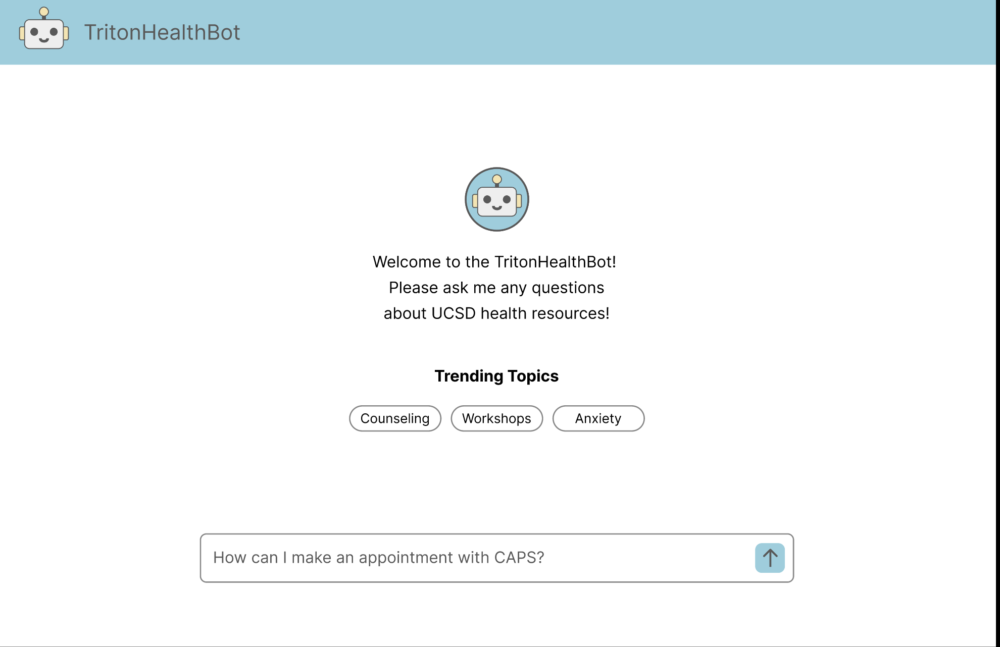
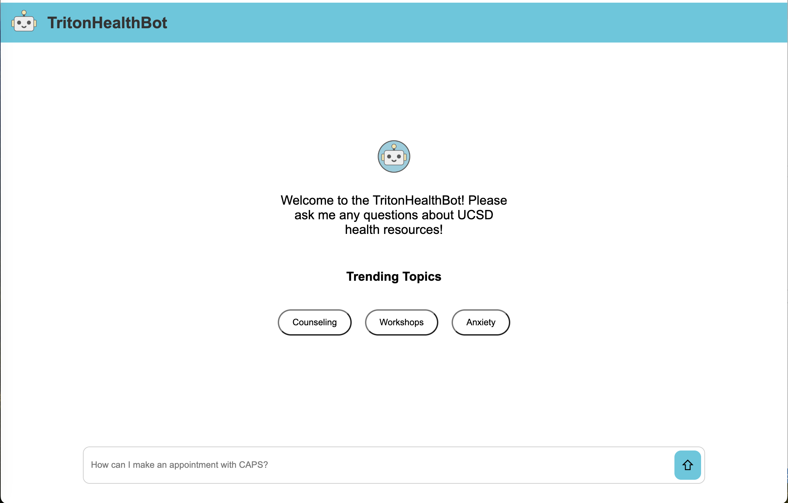

# FrontEnd - TritonHealthBot
## Design and Demo
### Design

### Demo

## Tech
### Framework
This project mainly use React framwork and Node.js tools. 
If you are using this project first time, please install dependencies by running:

    npm install

To render the pages in client proxy, run:    

    npm start

and open the localhost url that serve the pages, typically http://localhost:3000

### Structure
#### public
Contains some resource files generated by create-react-app. The most important one is index.html, the entry of the pages.

#### src
Contains all the source files of the project written by developer.
##### pages
Contains all the page-level component. Currently only Home page.

##### components
Contains all the components.

##### styles
Contains all the css files.

##### media
Contains all the images and other media resources.
